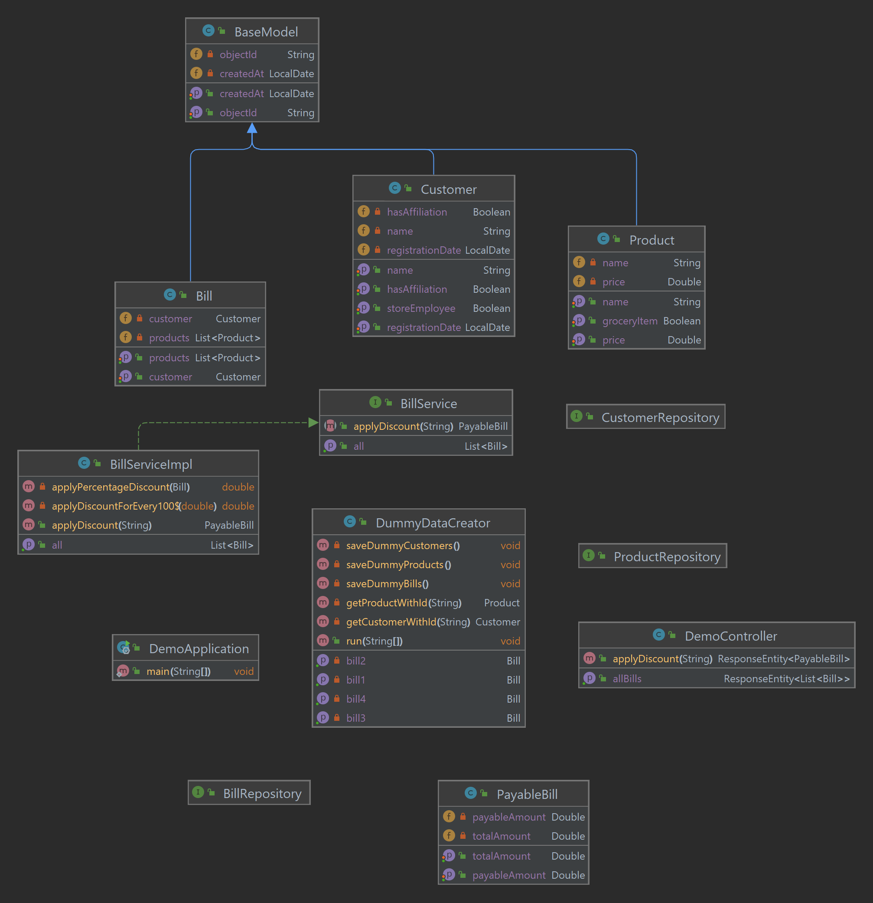

# Demo App

Technology assessment assignment
## Requirements

For building and running the application you need:

- [JDK 1.8](http://www.oracle.com/technetwork/java/javase/downloads/jdk8-downloads-2133151.html)
- [Maven 3](https://maven.apache.org)

## Running the application 
1- To build the jar
```shell
mvn clean install
```
2- To run the mongo-db and api services
```shell
docker-compose up
```
3- To run the tests
```shell
mvn test
```

## Application Structure
On start-up, DummyDataCreator class is responsible to save dummy data e.g Products, Customers, Bills etc
* Endpoint to apply discount on given bill id
```shell
Method: GET
URI: http://localhost:8080/applyDiscount/{billId}
Available Billing IDs: [62e64f01807ac164c11ae990, 62e64f01807ac164c11ae991, 62e64f01807ac164c11ae992, 62e64f01807ac164c11ae995]
Response Format: {
    "totalAmount": 0.0,
    "payableAmount": 0.0
}
```
* Endpoint to all bills available
```shell
Method: GET
URI: http://localhost:8080/bills
Response Format: [
{
        "objectId": "62e64f01807ac164c11ae991",
        "customer": {
            "objectId": "62e64f01807ac164c11ae851",
            "name": "Ibraheem",
            "hasAffiliation": true,
            "registrationDate": "2022-07-31",
            "storeEmployee": false
        },
        "products": [
            {
                "objectId": "62e64f01807ac164c11ae857",
                "name": "Laptop",
                "price": 1000.0,
                "groceryItem": false
            }
        ]
    }
]
```
## High level UML class diagram
